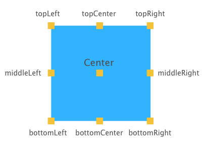

Let’s take the code below:

```
CGRect rect = button.frame;
rect.origin.x = tableView.frame.origin.x;
rect.origin.y = tableView.frame.origin.y + tableView.frame.size.height;
button.frame = rect;
```

Assuming button and tableView are in the same superview, the code aligns `button` just below  `tableView` and to the left. That’s grand, but there’s a lot of boilerplate code around and if you’re not using nib files, you’ll be writing a lot of code like this. Actually, even if you do use nib files you’ll probably going to write this stuff often enough to become a nuisance.

So [here](https://github.com/valentinradu/UIViewEasyPositioning/tree/master/UIViewEasyPositioning) are some categories that make things smoother. They provide a simple way of aligning your views relative to siblings or to arbitrary points. So the above code becomes:

```
button.topLeft = tableView.bottomLeft;
```

Which basically translates to:

*The top left anchor point of button will be in the same position as the bottom left anchor point of tableView.*

Here you go, a graphical representation of each anchor point for a better understanding:



It comes in many other flavours:

```
//centers the views vertically, aligns on top horizontally
button.topCenter = tableView.topCenter;

//aligns on right vertically, centers horizontally
button.middleRight = tableView.middleRight;

button.bottomCenter = CGPointMake(10, 20);
```
